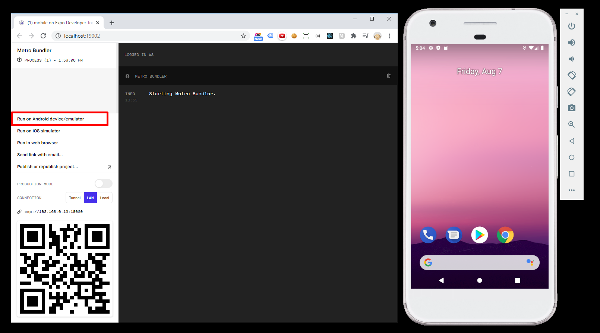

<p align="center">
  
</p>

# 📑 Índice

### [Mobile](#mobile)

- [Instalação e Configuração das Bibliotecas Mobile](#-instalação-e-configuração-das-bibliotecas-mobile)
- [Components](#components)
  - [Component: Page Header](#component-page-header)
  - [Component: Teacher Item](#component-teacher-item)
- [Páginas](#páginas)
  - [Página: Landing](#página-landing)
  - [Página: Teacher List](#página-teacher-list)
  - [Página: Give Classes](#página-give-classes)
  - [Página: Favorites](#página-favorites)
- [App](#app)
- [Conexão com a API](#conexão-com-a-api)


# Mobile

Vamos criar uma pasta 'mobile' que vai conter nossa aplicação.

## 📚 Instalação e Configuração das Bibliotecas Mobile

O "Android Studio" já deve estar instalado e um "Android Virtual Device" configurado.

**Instalar o Expo** : `yarn add -g expo-cli`

**Instalar o Template de aplicação de React Native**: `expo init  mobile`
Selecionar Template `> blank (TypeScript)`

**Instalar o React Navigation**: `yarn add @react-navigation/native`

**Instalar dependências do React Navigation para um projeto Expo**: `expo install react-native-gesture-handler react-native-reanimated react-native-screens react-native-safe-area-context @react-native-community/masked-view`

**Instalar a Stack Navigation (pilhas) do React Navigation**: `yarn add @react-navigation/stack`

**Instalar a Tab Natigation (abas) do React Navigation**: `yarn add @react-navigation/bottom-tabs`

## Executando o Emulador
Com o projeto criado e aberto, vamos executar o comando `emulator -avd [nome do dispositivo]` para abrir o AVD (Android Virtual Device).
Agora na pasta, vamos executar o `yarn start` para rodar a aplicação. Vai abrir uma janela "Expo Developer" no navegador que vai nos auxiliar com logs, debugs e outras funcionalidades. Agora, nessa janela do Expo, clicar no menu esquerdo em "Run on Android device/emulator", para a aplicação abrir automaticamente no seu AVD.

<p align="center">
  
</p>

## Lidando com  Images
Vamos criar uma pasta 'assets' e dentro dela uma subpasta 'images > icons' e adicionar todas as imagens .png que utilizaremos na nossa aplicação. Como estamos codando em Typescript precisamos fazer uma  configuração para que ele entenda a importação de imagens png. Na pasta 'src', vamos criar umma pasta '@types' e um arquivo 'index.d.ts'. Nesse arquivo vamos declarar é possível a importação de arquivos .png será na aplicação, por meio do código:

```ts
declare module '*.png';`

```

# Páginas
##  Página: Landing
Vamos criar uma pasta 'pages' e uma subpasta 'Landing' com um  arquivo 'index.tsx' e um 'styles.ts'. Vamos criar a primeira página da aplicação, Landing Page.
Para a estilização no React Native, utilizamos o 'StyleSheet', da qual nossos estilos são escritos em formato de objetos do js. Não possuímos herança de estilos como no HTML, todo estilo é feito de maneira particular para cada elemento da página. Outro ponto importante é que todos os elementos do React Native, vem com `display: 'flex'` e `flexDirection: 'columm'` como padrão.

No arquivo 'styles.ts' o código terá a seguinte estrutura: Começo importanto o StyleSheet, abro uma const styles e todos os estilos ficarão dentro dessa função create().  No final, eu exporto a função para poder aplicar na minha página.

```ts
import { StyleSheet } from "react-native";

const styles = StyleSheet.create({
  container: {
    flex: 1,
    backgroundColor: "#8257E5",
    justifyContent: "center",
    padding: 40,
  },
  
 // demais estilos
 
 });

export default styles;
  
``` 


##  Página: Teacher List
##  Página: Give Classes
##  Página: Favorites


# Components
## Component: Page Header
## Component: Teacher Item


# App

# Conexão com a API
